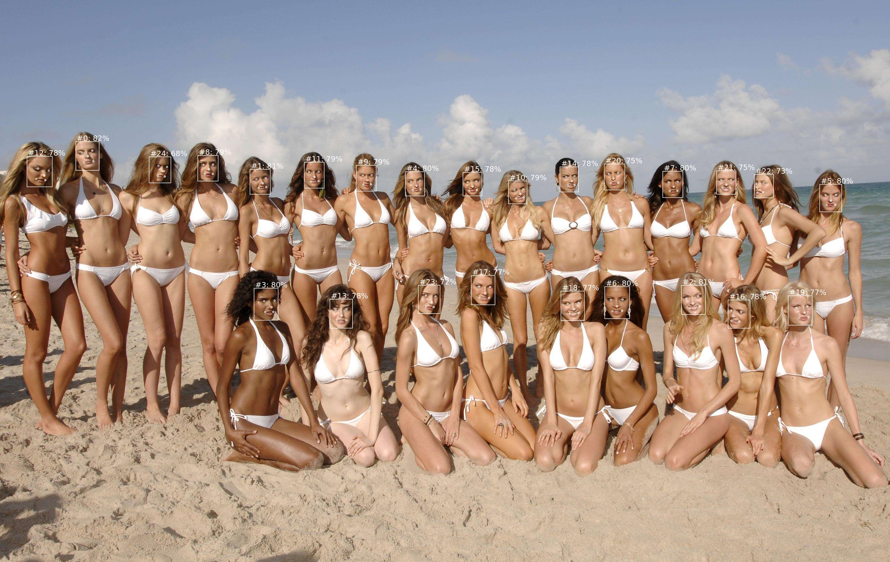

# DBFace: Face Detection for TFJS and NodeJS

**DBFace** models converted from **PyTorch** to **TFJS Graph Model**  
With native decode bounds and NMS functions in `TypeScript` to process results  

Compatible with 
- Browser (using `tfjs-wasm`, `tfjs-webgl` or `tfjs-webgpu` backends)
- NodeJS (using `tfjs-node` or `tfjs-node-gpu` modules)

Includes **16 variations** of **DBFace** models:
- **MobileNetv2** and **MobileNetv3** variations
- **Float32** and quantized **Float16** variations  
- Trained on multiple resolutions: **320x320**, **640x480**, **960x640** and **1280x800**

Examples of outputs of all model variations are included in [media folder](https://github.com/vladmandic/dbface/tree/main/media/out)

<br>
## Run

> npm start -- --model models/mb3-f32-800-1280/dbface.json --input media/in/models.jpg --output media/out/models-mb3-f32-800x1200.jpg

```js
{ application: 'dbface', version: '0.0.1' }
{
  options: {
    inImage: 'media/in/models.jpg',
    outImage: 'media/out/models-mb3-f32-800x1200.jpg',
    modelPath: 'file://models/mb3-f32-800-1280/dbface.json',
    minScore: 0.2,
    iouThreshold: 0.1,
    maxResults: 1000,
    inputSize: [ 0, 0 ]
  }
}
{ tensorflow: '3.12.0', backend: 'tensorflow', gpuEnabled: true, gpuActive: true }
{ memory: { bytes: 7123912, tensors: 252 } }
{ input: 'media/in/models.jpg', bytes: 24602400, resolution: [ 3600, 2278 ], tensor: [ 1, 800, 1280, 3 ], type: 'float32' }
{ predictTime: 155, processTime: 2, results: 538, nms: 25 }
{ scores: [
    0.82, 0.81, 0.81,  0.8,  0.8,
     0.8,  0.8,  0.8, 0.79, 0.79,
    0.79, 0.79, 0.78, 0.78, 0.78,
    0.78, 0.78, 0.77, 0.77, 0.77,
    0.75, 0.75, 0.73, 0.72, 0.68
  ] }
{ output: 'media/out/models-mb3-f32-800x1200.jpg', resolution: [ 3600, 2278 ] }
```

## Example



<br>

## Credit

- <https://github.com/dlunion/DBFace>
